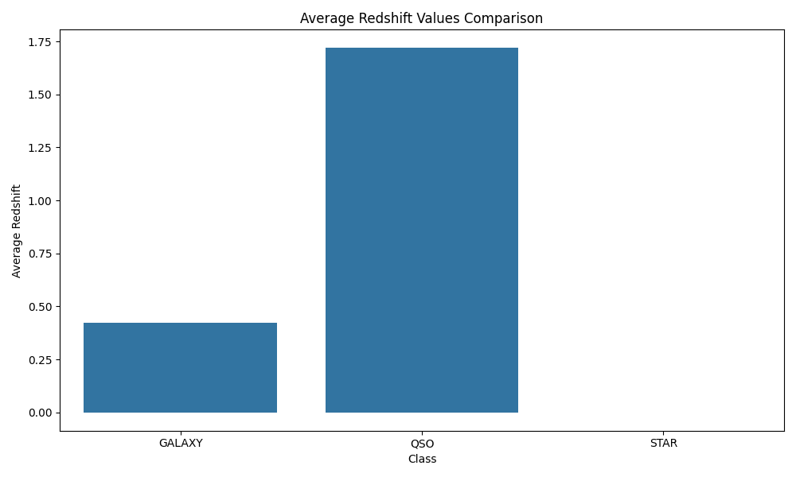

# Star Classification Data Analysis Project

## Overview

The Star Classification Data Analysis Project is an exploratory and analytical initiative focused on a dataset of celestial objects and their classifications. The primary objectives include:

- Importing data using PyMySQL.
- Conducting extensive data analysis.
- Presenting findings in a visually appealing and accessible format.

The dataset originates from the Stellar Classification Dataset - SDSS17, available on Kaggle. For more details, visit the dataset page: [Stellar Classification Dataset - SDSS17 on Kaggle](https://www.kaggle.com/datasets/fedesoriano/stellar-classification-dataset-sdss17).

## Dependencies

This project uses the following Python libraries:

- `pandas`: Facilitates reading, manipulating, and analyzing data in DataFrame format.
- `configparser`: Manages and retrieves database configurations.
- `PyMySQL`: Connects to the MySQL database and executes SQL statements.
- `tqdm`: Offers a progress meter for data insertion, enhancing visibility of the process.

## Project Components

### Database Creation

The database schema was designed with the following principles:

- **Single Table Structure**: Named `celestial_observations`, this approach streamlines querying by removing the need for complex joins.
- **Efficiency and Clarity**: Focuses on relevant data by excluding non-essential columns, thus optimizing performance and storage.
- **Direct Mapping**: Each row in the table directly represents a celestial observation, making the dataset easy to navigate and analyze.

### Data Importing

Key steps in the data importing process:

- **Data Read**: Loading 'star_classification.csv' into a pandas DataFrame.
- **Column Selection**: Filtering essential attributes such as 'obj_ID', 'alpha', 'delta', 'u', 'g', 'r', 'i', 'z', 'spec_obj_ID', 'class', 'redshift', 'plate', and 'MJD'.
- **Batch Insertion**: Utilizing PyMySQL's `executemany` method for efficient data insertion.
- **Progress Monitoring**: Employing tqdm for real-time progress visualization during data insertion.

### Data Analysis

- **Tools**: Utilizes Python and its libraries (Pandas, NumPy, etc.) for sophisticated data manipulation and analysis.
- **Objective**: The analysis aims to delve deep into the celestial data, uncovering patterns and deriving meaningful insights. Key areas include classification trends, observational data patterns, and statistical correlations.

The subsequent sections will detail specific queries and analytical findings, shedding light on the complexities and intricacies of celestial object classifications. 

---


```markdown
# Celestial Observations Analysis

This document outlines various SQL queries used for analyzing celestial observation data. Each query is designed to extract specific insights from the dataset, and there's a dedicated section for analysis based on the query results.

## Query 1: Average and Standard Deviation of Photometric Filters by Class

**Purpose**: Computes the average and standard deviation for ultraviolet, green, red, near-infrared, and infrared filters for each class of celestial object. This helps understand the variability in measurements for each class.

**SQL Query**:
```sql
SELECT
  class,
  AVG(u) AS avg_ultraviolet,
  STDDEV(u) AS stddev_ultraviolet,
  AVG(g) AS avg_green,
  STDDEV(g) AS stddev_green,
  AVG(r) AS avg_red,
  STDDEV(r) AS stddev_red,
  AVG(i) AS avg_near_infrared,
  STDDEV(i) AS stddev_near_infrared,
  AVG(z) AS avg_infrared,
  STDDEV(z) AS stddev_infrared
FROM
  celestial_observations
GROUP BY
  class;
```

**Analysis**: 
_Write your analysis here._

## Query 2: Celestial Objects with the Highest Redshift

**Purpose**: Identifies the celestial objects with the highest redshift values to find the farthest or oldest objects.

**SQL Query**:
```sql
SELECT
  *,
  plate
FROM
  celestial_observations
ORDER BY
  redshift DESC
LIMIT 10;
```

**Analysis**: 
_Write your analysis here._

## Query 3: Distribution of Observations Across Different Plates

**Purpose**: Analyzes the distribution of observations across different plates along with the average redshift observed in each plate.

**SQL Query**:
```sql
SELECT
  plate,
  COUNT(*) AS observation_count,
  AVG(redshift) AS avg_redshift
FROM
  celestial_observations
GROUP BY
  plate
ORDER BY
  observation_count DESC;
```

**Analysis**: 
_Write your analysis here._

## Query 4: Average Redshift Values Comparison

**Purpose**: Compares the average redshift values between galaxies, stars, and quasars, including the minimum and maximum values for each.

**SQL Query**:
```sql
SELECT
  class,
  AVG(redshift) AS average_redshift,
  MIN(redshift) AS min_redshift,
  MAX(redshift) AS max_redshift
FROM
  celestial_observations
GROUP BY
  class;
```



**Analysis**: 
    Stars: Stars have an average redshift of 0, indicating that they are neither receding nor approaching us at significant velocities on a cosmic scale. This is consistent with the fact that stars are typically part of our own galaxy or local group, where the expansion of the universe has a negligible effect on their observed redshift.

    Galaxies: They exhibit a greater redshift than stars, with an average value just above 0.25. This suggests that galaxies are moving away from us, which is expected due to the expansion of the universe. The galaxies shown here are likely at a considerable distance from our own galaxy but not as distant as quasars.

    Quasars (QSO): They have a much higher average redshift compared to galaxies and stars, which aligns with the fact that quasars are among the most distant objects observed in the universe. Their high redshift values indicate that they are moving away from us at a much faster rate, which is also a reflection of their vast distance and age.

## Query 5: Class Frequency and Average Values for Photometric Filters

**Purpose**: Counts how many of each class of object (galaxy, star, quasar) are in the dataset and includes average values for photometric filters.

**SQL Query**:
```sql
SELECT
  class,
  COUNT(*) AS frequency,
  AVG(u) AS avg_u,
  AVG(g) AS avg_g,
  AVG(r) AS avg_r,
  AVG(i) AS avg_i,
  AVG(z) AS avg_z
FROM
  celestial_observations
GROUP BY
  class;
```

**Analysis**: 
_Write your analysis here._
```
