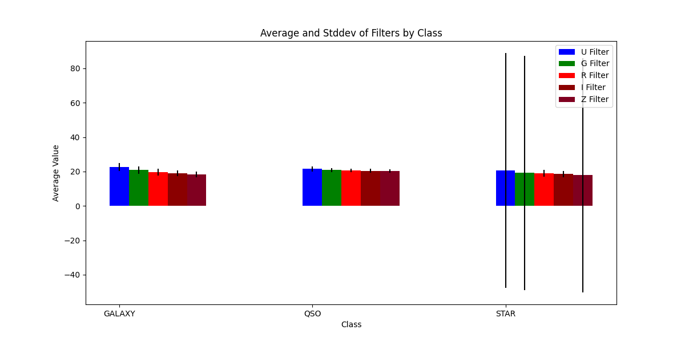
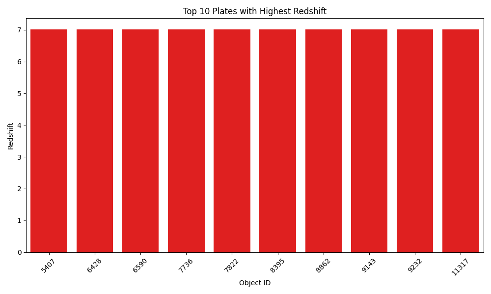

# Star Classification Data Analysis Project

## Project Components

### 1. Data Importing: 
Firstly, utilizing PyMySQL along with other relevant packages listed in the dependencies section, the stellar classification data was entered into a database. This involves the following steps:

  - **Data Read**: Loading 'star_classification.csv' into a pandas DataFrame.
  - **Column Selection**: Filtering essential attributes such as 'obj_ID', 'alpha', 'delta', 'u',   'g', 'r', 'i', 'z', 'spec_obj_ID', 'class', 'redshift', 'plate', and 'MJD'.
  - **Batch Insertion**: Utilizing PyMySQL's `executemany` method for efficient data insertion.
  - **Progress Monitoring**: Employing tqdm for real-time progress visualization during data    insertion.

### 2. Database Design:
After several attempts and database design ideas, I finally decided on a single-table database named `celestial_observations` for the following reasons:

- **Single Table Structure**: Named `celestial_observations`, this approach streamlines querying by removing the need for complex joins.
- **Efficiency and Clarity**: Focuses on relevant data by excluding non-essential columns, thus optimizing performance and storage. While simple, this design focuses on efficiency and clarity and since all columns directly relate to each observation there is no need to split them up.
- **Direct Mapping**: Each row in the table directly represents a celestial observation, streamlining the querying process and making the data easier to navigate and analyze.

### 3. Data Analysis:
- I conducted data analysis through various SQL queries. These queries were designed to extract specific insights from the dataset, such as the average and standard deviation of photometric filters by class, the identification of celestial objects with the highest redshift, and the distribution of observations across different plates.

## Learned

### 1. PyMySQL:
- I learned how to effectively use PyMySQL to manage all functions of a database. I also explored database outputs other than console by integrating PyMySQL with statistical analysis packages.

### 2. Data Visualization Skills:
- By presenting my findings through visualizations created using matplotlib.pyplot and seaborn, I gained a deeper appreciation for the power of data visualization in conveying complex information in an accessible and hopefully engaging manner.

### 3. Astronomical Insights:
- The project deepened my knowledge of celestial objects, and their unique characteristics. Understanding the significance of photometric filters and redshift in astronomy was particularly interesting.

## Why is this data valuable?

### 1. Solving Universal Mysteries:
- The data provided insights into the characteristics and behaviors of various celestial objects. Understanding these aspects is crucial in the field of astronomy and astrophysics, as it contributes to our knowledge of the universe and our place within it.

### 2. Real-World Applications:
- The analysis of such data has real-world implications in the study of the universe's expansion, the life cycle of stars, and the evolution of galaxies. It's fascinating to contribute to a field that has such far-reaching and profound implications.

### 3. Technical Skill Enhancement:
- The project was an excellent opportunity to refine my technical skills in data analysis, SQL, and Python programming. It was rewarding to apply these skills to the field of astronomy which I am passionate about. I hope to work more on the project and later create a neural network using supervised learning to classify the objects.


## Dependencies

This project uses the following Python libraries:

- `pandas`:  Reading, manipulating, and analyzing data in DataFrame format.
- `matplotlib.pyplot`: Creating visualizations.
- `seaborn`: Improved aesthetics and additional plot types than matplotlib
- `configparser`: Manages and retrieves database configurations.
- `PyMySQL`: Connects to the MySQL database and executes SQL statements.
- `logging`: Logging of errors
- `os`: Directories and file operations.

## Files

- `query.py`: Runs queries and plot generation
- `createDatabase.py`: Creates database and fills with data from csv


## Data Analysis

## Query 1: Average and Standard Deviation of Photometric Filters by Class


**SQL Query**:
```sql
SELECT
  class,
  AVG(u) AS avg_ultraviolet,
  STDDEV(u) AS stddev_ultraviolet,
  AVG(g) AS avg_green,
  STDDEV(g) AS stddev_green,
  AVG(r) AS avg_red,
  STDDEV(r) AS stddev_red,
  AVG(i) AS avg_near_infrared,
  STDDEV(i) AS stddev_near_infrared,
  AVG(z) AS avg_infrared,
  STDDEV(z) AS stddev_infrared
FROM celestial_observations
GROUP BY class;
```




**Analysis**: 
This grouped bar chart shows the average values of different photometric filters: ultraviolet, green, red, near infrared, and infrared for three classes of celestial objects: GALAXY, QUASAR, and STAR. Each filter's average value is represented by a bar in a unique color representing the values. The standard deviation in the plot indicates the amount of variation or dispersion of the filter values from their amean. It shows how much the individual measurements of a particular filter for a class deviate from the average value of that filter for that class. The high standard deviation in the STAR's ultraviolet, green, and infrared shows the very high variability of subtypes in the star class. This is explained by stars have a wide variety of spectral types, sizes and temperatures.

## Query 2: Celestial Objects with the Highest Redshift


**SQL Query**:
```sql
SELECT plate, redshift
FROM celestial_observations
ORDER BY redshift DESC
LIMIT 10;
```



**Analysis**: 
This query shows the top ten plates with the highest redshift. Each of these plates are the home to the farthest and oldest on average objects in the sky. 

## Query 3: Distribution of Observations Across Different Plates


**SQL Query**:
```sql
(SELECT plate, COUNT(*) AS observation_count, 'Top 10' AS category
 FROM celestial_observations 
 GROUP BY plate 
 ORDER BY observation_count DESC LIMIT 10)
UNION ALL
(Select plate, COUNT(*) AS observation_count, 'Bottom 10' AS category
 FROM celestial_observations
 GROUP BY plate
 ORDER BY observation_count ASC
 LIMIT 10);
```


**Analysis**: 
This query nalyzes the distribution of observations across different plates along with the average redshift observed in each plate. It shows the top 10 highest and lowest plates by redshift. Which examines the large variation where the most populous plate has 98 objects and the least populous have 1.

## Query 4: Average Redshift Values Comparison


**SQL Query**:
```sql
SELECT class, AVG(redshift) AS average_redshift, MIN(redshift) AS min_redshift, 
       MAX(redshift) AS max_redshift 
FROM celestial_observations 
GROUP BY class;
```


**Analysis**: 
Stars have an average redshift of 0.000 with the minimum being -0.004 and the maximum being 0.004, indicating that they are neither receding nor approaching us at significant velocities on a cosmic scale. This is consistent with the fact that stars are typically part of our own galaxy or local group, where the expansion of the universe has a negligible effect on their observed redshift.

Galaxies have an average redshift of 0.422 with the minimum being -0.010 and the maximum being 1.996. This suggests that galaxies are moving away from us, which is expected due to the expansion of the universe. The galaxies shown here are likely at a considerable distance from our own galaxy but not as distant as quasars.

Quasars have an average redshift of They have a much higher average redshift compared to galaxies and stars, which 1.720 with a minimum of 0.000 and a maximum of 7.011. This aligns with the fact that quasars are among the most distant objects observed in the universe. Their high redshift values indicate that they are moving away from us at a much faster rate, which is a reflection of their vast distance and age.

## Query 5: Class Frequency and Average Values for Photometric Filters


**SQL Query**:
```sql
SELECT
  class,
  COUNT(*) AS frequency
FROM
  celestial_observations
GROUP BY
  class;
```


**Analysis**: 
This query aims to count the number of celestial objects in each class (GALAXY, STAR, QUASAR) within the dataset. It, along with the generated plot shows that galaxies are the most populous celestial body in the dataset and probably observable universe with 59445 shown in the dataset. Stars are the next most frequent class with 21594 observations. Quasars fall closely behind with 18961 observations.

