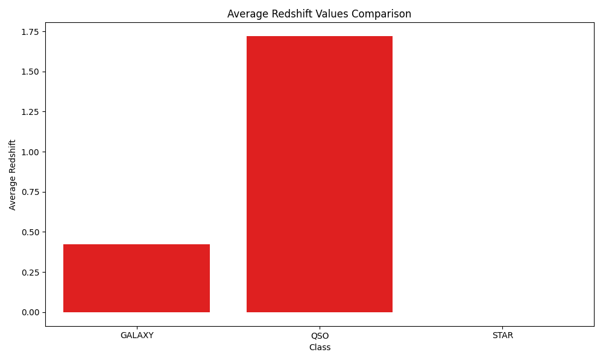
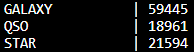

# Star Classification Data Analysis Project

## Overview

The Star Classification Data Analysis Project is an exploratory and analytical initiative focused on a dataset of celestial objects and their classifications. The primary objectives include:

- Importing data using PyMySQL.
- Conducting extensive data analysis.
- Presenting findings in a visually appealing and accessible format.

The dataset originates from the Stellar Classification Dataset - SDSS17 from the Sloan Digital Sky Survey, available on Kaggle. For more details, visit the dataset page: [Stellar Classification Dataset - SDSS17 on Kaggle](https://www.kaggle.com/datasets/fedesoriano/stellar-classification-dataset-sdss17).

## Dependencies

This project uses the following Python libraries:

- `pandas`: Facilitates reading, manipulating, and analyzing data in DataFrame format.
- `matplotlib.pyplot`: Used for creating static, animated, and interactive visualizations.
- `seaborn`: Enhances matplotlib plots with improved aesthetics and additional plot types.
- `configparser`: Manages and retrieves database configurations.
- `PyMySQL`: Connects to the MySQL database and executes SQL statements.
- `logging`: Handles the logging of errors and information.
- `os`: Manages directories and file operations.

## Project Components

### Database Creation

The database schema was designed with the following principles:

- **Single Table Structure**: Named `celestial_observations`, this approach streamlines querying by removing the need for complex joins.
- **Efficiency and Clarity**: Focuses on relevant data by excluding non-essential columns, thus optimizing performance and storage.
- **Direct Mapping**: Each row in the table directly represents a celestial observation, making the dataset easy to navigate and analyze.

### Data Importing

Key steps in the data importing process:

- **Data Read**: Loading 'star_classification.csv' into a pandas DataFrame.
- **Column Selection**: Filtering essential attributes such as 'obj_ID', 'alpha', 'delta', 'u', 'g', 'r', 'i', 'z', 'spec_obj_ID', 'class', 'redshift', 'plate', and 'MJD'.
- **Batch Insertion**: Utilizing PyMySQL's `executemany` method for efficient data insertion.
- **Progress Monitoring**: Employing tqdm for real-time progress visualization during data insertion.

### Data Analysis


The next sections will detail specific queries and analytical findings, showing the complexities and intricacies of celestial object classifications. This document outlines various SQL queries used for analyzing celestial observation data. Each query is designed to extract specific insights from the dataset. The data from the queries is then directly converted into a visual plot to further analyze the data.


## Query 1: Average and Standard Deviation of Photometric Filters by Class

**Purpose**: Computes the average and standard deviation for ultraviolet, green, red, near-infrared, and infrared filters for each class of celestial object. This helps understand the variability in measurements for each class.

**SQL Query**:
```sql
SELECT
  class,
  AVG(u) AS avg_ultraviolet,
  STDDEV(u) AS stddev_ultraviolet,
  AVG(g) AS avg_green,
  STDDEV(g) AS stddev_green,
  AVG(r) AS avg_red,
  STDDEV(r) AS stddev_red,
  AVG(i) AS avg_near_infrared,
  STDDEV(i) AS stddev_near_infrared,
  AVG(z) AS avg_infrared,
  STDDEV(z) AS stddev_infrared
FROM celestial_observations
GROUP BY class;
```


**Analysis**: 
This grouped bar chart showing the average values of different photometric filters (U, G, R, I, Z) for three classes of celestial objects: GALAXY, QSO (quasi-stellar object or quasar), and STAR. Each filter's average value is represented by a bar in a unique color. The standard deviation in the plot indicates the amount of variation or dispersion of the filter values from their average (mean). Specifically, it shows how much the individual measurements of a particular filter for a class (GALAXY, QSO, or STAR) deviate from the average value of that filter for that class. The high standard deviation in the STAR's ultraviolet, green, and infrared shows the diverse variability of subtypes in the star class. Stars have a wide variety of types, sizes and temperatures which explains the wide standard deviation.

## Query 2: Celestial Objects with the Highest Redshift

**Purpose**: Identifies the celestial objects with the highest redshift values to find the farthest or oldest objects.

**SQL Query**:
```sql
SELECT plate, redshift
FROM celestial_observations
ORDER BY redshift DESC
LIMIT 10;
```


**Analysis**: 
This query shows the top ten plates with the highest redshift. Each of these plates are the home to the oldest on average objects in the sky. 

## Query 3: Distribution of Observations Across Different Plates

**Purpose**: Analyzes the distribution of observations across different plates along with the average redshift observed in each plate.

**SQL Query**:
```sql
(SELECT plate, COUNT(*) AS observation_count, 'Top 10' AS category
 FROM celestial_observations 
 GROUP BY plate 
 ORDER BY observation_count DESC LIMIT 10)
UNION ALL
(Select plate, COUNT(*) AS observation_count, 'Bottom 10' AS category
 FROM celestial_observations
 GROUP BY plate
 ORDER BY observation_count ASC
 LIMIT 10);
```


**Analysis**: 
The query accompanied by the plot shows the top 10 highest and lowest plates by redshift. This shows the large variation where the most populous plate has 98 objects and the least populous have 1.
## Query 4: Average Redshift Values Comparison

**Purpose**: Compares the average redshift values between galaxies, stars, and quasars, along with the minimum and maximum values for each.

**SQL Query**:
```sql
SELECT class, AVG(redshift) AS average_redshift, MIN(redshift) AS min_redshift, 
       MAX(redshift) AS max_redshift 
FROM celestial_observations 
GROUP BY class;
```



**Analysis**: 
The data shows that stars have an average redshift of 0.000 with the minimum being -0.004 and the maximum being 0.004, indicating that they are neither receding nor approaching us at significant velocities on a cosmic scale. This is consistent with the fact that stars are typically part of our own galaxy or local group, where the expansion of the universe has a negligible effect on their observed redshift.

The data shows that galaxies have an average redshift of 0.422 with the minimum being -0.010 and the maximum being 1.996. This suggests that galaxies are moving away from us, which is expected due to the expansion of the universe. The galaxies shown here are likely at a considerable distance from our own galaxy but not as distant as quasars.

Quasars have an average redshift of They have a much higher average redshift compared to galaxies and stars, which 1.720 with a minimum of 0.000 and a maximum of 7.011. This aligns with the fact that quasars are among the most distant objects observed in the universe. Their high redshift values indicate that they are moving away from us at a much faster rate, which is a reflection of their vast distance and age.

## Query 5: Class Frequency and Average Values for Photometric Filters

**Purpose**: This query aims to count the number of celestial objects in each class (GALAXY, STAR, QUASAR) within the dataset.

**SQL Query**:
```sql
SELECT
  class,
  COUNT(*) AS frequency
FROM
  celestial_observations
GROUP BY
  class;
```



**Analysis**: 
This query along with the generated plot shows that galaxies are the most populous celestial body in the dataset and probably observable universe with 59445 shown in the dataset. Stars are the next most frequent class with 21594 observations. Quasars fall closely behind with 18961 observations.

